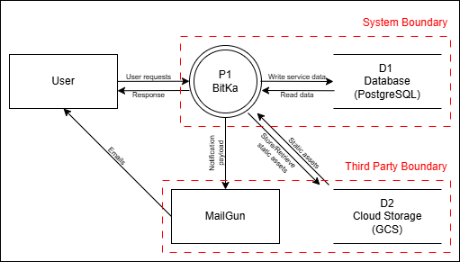
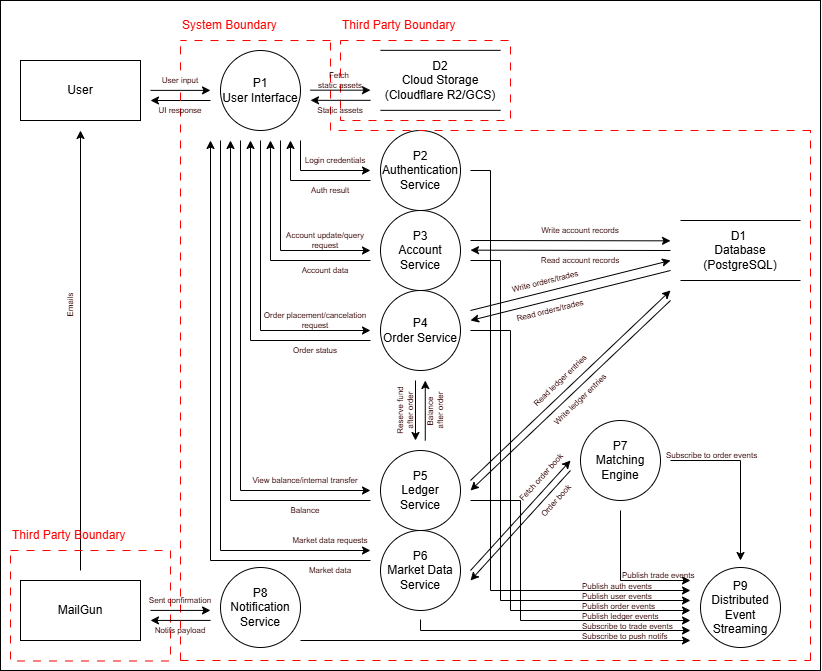

## BitKa Threat Model

* **Application Version:** 28/11/2025 
* **Description:** A microservice-based digital wallet and trading backend that provides secure custodial account management, real-time market data access, and a verifiable off-chain ledger. The platform enables users to register and authenticate, manage profiles, deposit tokens, transfer funds, place trade orders, and initiate withdrawals signed by custody-controlled keys. It incorporates durable asynchronous processing for transactional correctness, integrates with Mailgun and Cloudflare R2/GCS, authenticates internal services through a layered trust model, and maintains operational readiness through CI/CD and comprehensive audit logs.
* **Document Owner:** Thanisara Satalalai 

---

### External Dependencies

External dependencies are items outside of the application code.

| ID | Description |
| :--- | :--- |
| 1 | Bitka and its database is running on a Linux server running Ubuntu. |
| 2 | BitKa's cloud storage is on Cloudflare R2 / Google Cloud Storage (GCS). |
| 3 | MailGun is used to send out notifications to users. |

---

### Entry Points

Entry points are the interfaces in which the user can feed data into the system.

| ID | Name | Description | Trust Levels |
| :--- | :--- | :--- | :--- |
| **1** | **HTTPS port** | The primary public network port. | (4) Application layer services  |
| **1.1** | **User UI** | Front-end web interface delivered via HTTPS. It is the primary entry point for end-users and initiates all user-driven workflows. | (4) Application layer services  |
| 1.1.1 | Log in page | Public interface that collects user credentials and initiates authentication flows. | (2) Anonymous user  |
| 1.1.2 | Registration page | Public interface allowing new users to create new accounts. | (2) Anonymous user  |
| 1.1.3 | Account page | Authenticated user interface detailing account information. | (2) Anonymous user  |
| 1.1.3.1 | Account page: Profile setup | First-time profile configuration after registration, where users enter initial identity details. | (3) Authorize user  |
| 1.1.3.2 | Account page: Profile setting | Page allowing users to modify their profile details and preferences after initial setup. | (3) Authorize user  |
| 1.1.4 | Transaction page | Page that enables users to initiate transfer and view transfer history. | (3) Authorize user  |
| 1.1.4.1 | Transaction page: Transfer placing | User interface for initiating transfer within the system. | (3) Authorize user  |
| 1.1.4.2 | Transaction page: Transfer confirmation | Displays transaction summary for user to verify prior to execution. | (3) Authorize user  |
| 1.1.4.3 | Transaction page: Transfer success | Confirmation screen displaying status of successful transfer. | (3) Authorize user  |
| 1.1.5 | Withdraw page | Page that enables users to initiate withdrawal. | (3) Authorize user  |
| 1.1.5.1 | Withdraw page: Withdraw confirmation | Displays withdraw summary for user to verify prior to execution. | (3) Authorize user  |
| 1.1.5.2 | Withdraw page: Withdraw success | Confirmation screen displaying status of successful withdrawal. | (3) Authorize user  |
| 1.1.6 | Trade page | User interface for displaying market data and placing markets and limited trade orders. | (3) Authorize user  |
| 1.1.6.1 | Trade page: Main | Landing page displaying market data, order forms, and trade history. | (3) Authorize user  |
| 1.1.6.2 | Trade page: Limited buy | Interface for placing buy orders with specified price and quantity. | (3) Authorize user  |
| 1.1.6.3 | Trade page: Limited sell | Interface for placing sell orders with specified price and quantity. | (3) Authorize user  |
| 1.1.6.4 | Trade page: Market buy | Interface enabling instant market buy orders. | (3) Authorize user  |
| 1.1.6.5 | Trade page: Market sell | Interface enabling instant market sell orders. | (3) Authorize user  |
| **2** | **API endpoints** | internal entry points  | (4) Application layer services  |
| 2.1 | Authentication service | all authentication operations  | (4) Application layer services  |
| 2.1.1 | POST `https://api.bitka.polishstack.com/v1/auth/login` | Login  | (2) Anonymous user  |
| 2.1.2 | POST `https://api.bitka.polishstack.com/v1/auth/register` | Register  | (2) Anonymous user  |
| 2.1.3 | POST `https://api.bitka.polishstack.com/v1/auth/refresh` | Refresh access token  | (3) Authorize user  |
| 2.1.4 | POST `https://api.bitka.polishstack.com/v1/auth/logout` | Logout  | (3) Authorize user  |
| 2.1.5 | GET `https://api.bitka.polishstack.com/v1/.well-known/jwks.json` | JWKS (JSON Web Key Set)  | (2) Anonymous user  |
| 2.2 | Account service | Provides access to user data, profile management, and security management. | (4) Application layer services  |
| 2.2.1 | GET `https://api.bitka.polishstack.com/v1/users/me` | Get current user profile. | (3) Authorize user  |
| 2.2.2 | PATCH `https://api.bitka.polishstack.com/v1/users/me` | Update current user profile. | (3) Authorize user  |
| 2.2.3 | GET `https://api.bitka.polishstack.com/v1/users/:id` | Get user profile by ID. | (3) Authorize user  |
| 2.2.4 | POST `https://api.bitka.polishstack.com/v1/users/me/change-password` | Change password for the authenticated user. | (3) Authorize user  |
| 2.3 | Ledger service | Handles account balances, transactions and histories. | (4) Application layer services  |
| 2.3.1 | GET `https://api.bitka.polishstack.com/v1/ledger/accounts` | List ledger accounts. | (3) Authorize user  |
| 2.3.2 | GET `https://api.bitka.polishstack.com/v1/ledger/accounts/:account_id` | Get ledger account by id. | (3) Authorize user  |
| 2.3.3 | GET `https://api.bitka.polishstack.com/v1/ledger/transactions` | List transactions. | (3) Authorize user  |
| 2.3.4 | POST `https://api.bitka.polishstack.com/v1/ledger/transactions` | Create a transaction (debit/credit/transfer). | (3) Authorize user  |
| 2.3.5 | GET `https://api.bitka.polishstack.com/v1/ledger/transactions/:transaction_id` | Get transaction by id. | (3) Authorize user  |
| 2.4 | Order service | Manages trade order creation, querying, and lifecycle operations. | (4) Application layer services  |
| 2.4.1 | POST `https://api.bitka.polishstack.com/v1/orders` | Create order. | (3) Authorize user  |
| 2.4.2 | GET `https://api.bitka.polishstack.com/v1/orders` | List orders (filterable). | (3) Authorize user  |
| 2.4.3 | GET `https://api.bitka.polishstack.com/v1/orders/:order_id` | Get order by id. | (3) Authorize user  |
| 2.4.4 | DELETE `https://api.bitka.polishstack.com/v1/orders/:order_id` | Cancel order by id. | (3) Authorize user  |
| 2.5 | Market data service | Provides market-related information such price data, order books, and real-time feeds. | (4) Application layer services  |
| 2.5.1 | GET `https://api.bitka.polishstack.com/v1/marketdata/symbols` | List available symbols (market pairs). | (3) Authorize user  |
| 2.5.2 | GET `https://api.bitka.polishstack.com/v1/marketdata/candles` | Get candles (OHLCV) for a symbol and interval (historical). | (3) Authorize user  |
| 2.5.3 | GET `https://api.bitka.polishstack.com/v1/marketdata/ticks` | Get trades (ticks) for a symbol (historical). | (3) Authorize user  |
| 2.5.4 | GET `https://api.bitka.polishstack.com/v1/marketdata/orderbook/:symbol` | Orderbook snapshot (top N) for a symbol. | (3) Authorize user  |
| 2.5.5 | GET `https://api.bitka.polishstack.com/v1/marketdata/orderbook/:symbol/history` | Historical orderbook deltas/snapshots for reconciliation. | (3) Authorize user  |
| 2.5.6 | GET `https://api.bitka.polishstack.com/v1/marketdata/stream` | Real-time streaming info (WebSocket). | (3) Authorize user  |
| **3** | **Third party entry points** | Entry points for external, non user services. | (1) External services  |
| 3.1 | Mailgun | External system used for delivering subscription emails. | (1) External services  |
| 3.2 | Cloudflare R2/GCS | External object storage used for storing avatar, token icon, or other static files. | (1) External services  |

---

### 🛡️ Assets

Assets are valuable things that need to be kept safe.

| ID | Name | Description | Trust Levels |
| :--- | :--- | :--- | :--- |
| **1** | **User** | Assets related to users. | (2) Anonymous user  |
| 1.1 | User credentials | User's username and password. | (3) Authorize user  |
| 1.2 | JWT | Token generated when user logs in, used to verify identity when user tries to access protected resource. | (4) Application layer services  |
| 1.2.1 | Access token | Proves identity for short periods. | (4) Application layer services  |
| 1.2.2 | Refresh token | Used to obtain new access tokens. | (3) Authorize user  |
| 1.2.3 | Public key | Public keys for token verification. | (2) Anonymous user  |
| 1.2.4 | Private key | Secret key for signing JWTS. | (5) Internal services  |
| 1.3 | User data | Any personal or account-related data the application stores about a user. | (3) Authorize user  |
| **2** | **Service** | Assets related to application and backend services. | (5) Internal services  |
| 2.1 | Site Availability | Bitka should always be available and all of its services should be working as intended. | (5) Internal services  |
| **3** | **Infrastructure** | Assets related to platform and deployment environment. | (5) Internal services  |
| 3.1 | Database | PostgreSQL that stores service data. | (5) Internal services  |
| 3.2 | TLS Certificates | Used to secure all communications between User UI and internal server. | (5) Internal services  |
| 3.3 | Secret assets | Admin user credentials, database password, env files. | (6) Admin  |

---

### Trust Level Definitions

| ID | Name | Description |
| :--- | :--- | :--- |
| 1 | External services | Third party services that interact with services. |
| 2 | Anonymous user | User who has accessed the site but has yet to log in. |
| 3 | Authorize user | User who has logged in to the site with valid credentials. |
| 4 | Application layer services | Services that face the outside system and receive public input. |
| 5 | Internal services | Service that only communicates with internal system. |
| 6 | Admin | User with full privilege to manage website, services, and database. |

---

### Data Flow Diagram

**Level 0 Data Flow Diagram**

**Level 1 Data Flow Diagram**

---

### STRIDE Threat Lists and Mitigation

#### Spoofing 

| ID | Component Involved | Entry Point | Target Asset | Description | Mitigation Ideas |
| :--- | :--- | :--- | :--- | :--- | :--- |
| 1 | User/P1 | 1.1.1 Log in page (UI), 2.1.1 POST /auth/login | 1.1 User credentials, 1.2 JWT | An attacker spoofs a legitimate User to gain unauthorized access to the application. | Implement MFA. |
| 2 | P2 | 2. API endpoints (Internal Calls) | 2. Service, 1.2.4 Private key | An attacker spoofs P2 to trick other services into accepting unauthorized requests. | Authenticate interservice communication. |
| 3 | MailGun/P8 | 3.1 Mailgun | 2. Service, 3.3 Secret assets | An attacker spoofs Mailgun to send fake emails to the user or send fake confirmation status back to P8. | Clear communication with users when a third party service is compromised. Audit actions done by third party services. |

#### Tampering 

| ID | Component Involved | Entry Point | Target Asset | Threat Description | Mitigation Ideas |
| :--- | :--- | :--- | :--- | :--- | :--- |
| 1 | Data Flows (In Transit) | 1. HTTPS port, 2. API endpoints | 1.3 User data, 1.2 JWT | An attacker modifies data being passed between services. | Authenticate interservice communication. |
| 2 | D1/D2 | All POST/PATCH endpoints | 3.1 Database, 1.3 User data | An attacker directly modifies account records, orders/trades, or static assets in the data stores. | Utilized principle of least privilege for accounts accessing the database. |
| 3 | P9 | 2. API endpoints (Internal Calls) | 2. Service, 1.3 User data | An attacker injects or modifies events in the stream. | Input authentication for data going to P9 service. |

#### Repudiation 

| ID | Component Involved | Entry Point | Target Asset | Threat Description | Mitigation Ideas |
| :--- | :--- | :--- | :--- | :--- | :--- |
| 1 | P4 | 1.1.6.2-5 Trade page, 2.3.4 POST /ledger/transactions, 2.4.1 POST /orders | 1.3 User data, 3.1 Database | A user places an order but later denies placing it. | Log all actions done by users. |

#### Information disclosure 

| ID | Component Involved | Entry Point | Target Asset | Threat Description | Mitigation Ideas |
| :--- | :--- | :--- | :--- | :--- | :--- |
| 1 | D1 | All GET endpoints | 3.1 Database, 1.1 User credentials, 1.3 User data | Sensitive data is leaked from the database. | Data encryption, strict access control lists and network segregation. |
| 2 | Data Flows (In Transit) | 1. HTTPS port, 2. API endpoints | 1.1 User credentials, 1.3 User data | Sensitive data is intercepted. | Ensure TLS is used end-to-end. Avoid logging sensitive data in plain text. |

#### Denial of service 

| ID | Component Involved | Entry Point | Target Asset | Threat Description | Mitigation Ideas |
| :--- | :--- | :--- | :--- | :--- | :--- |
| 1 | P1/P2 | 1. HTTPS port, 2.1.1 POST /auth/login | 2.1 Availability of the site | An attacker floods the public endpoints with requests. | Rate limiting on public APIs. Implement DDoS mitigation services. |
| 2 | P4/P7 | All authorized user endpoints | 2.1 Availability of the site | An attacker floods authorised user services with requests. | Rate limit user on service user/api calls. |
| 3 | D1 | All GET/POST endpoints | 3.1 Database, 2.1 Availability of the site | The database is overwhelmed by too many read/write requests from the services. | Proper indexing and query optimization. |

#### Elevation of privilege

| ID | Component Involved | Entry Point | Target Asset | Threat Description | Mitigation Ideas |
| :--- | :--- | :--- | :--- | :--- | :--- |
| 1 | P1/P2 | All authorized user endpoints | 1.3 User data, 6. Admin | An attacker with a basic user account exploits a vulnerability to gain administrator privileges. | Role-Based Access Control, Input validation and principle of least privilege. |
| 2 | Inter-Service Flows | 2. API endpoints (Internal Calls) | 2. Service, 3.3 Secret assets | A compromised service uses its internal credentials to perform actions it shouldn't. | Authenticate interservice communication. |